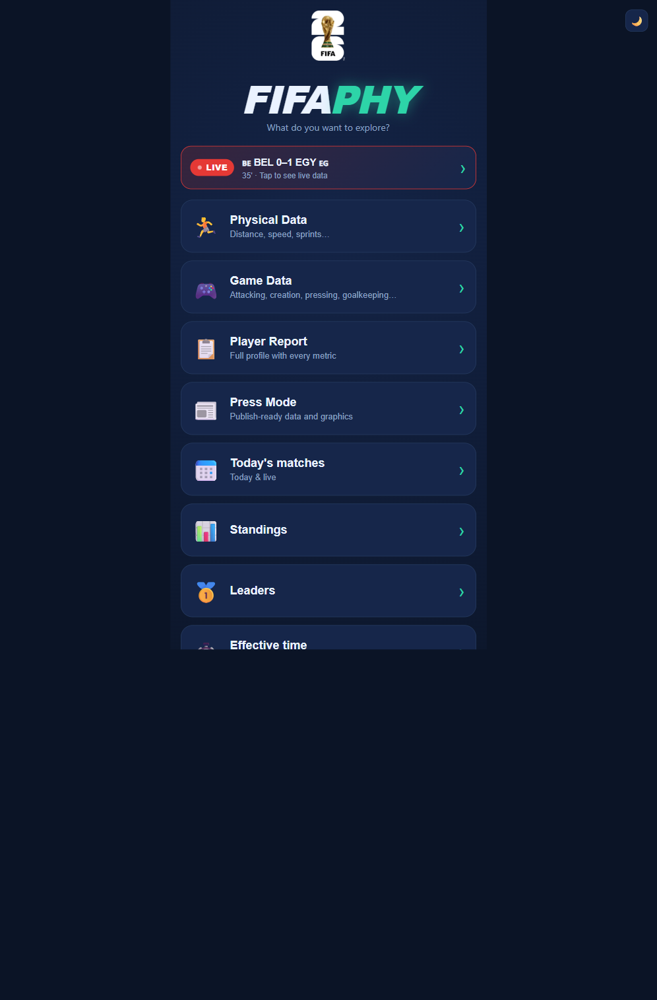
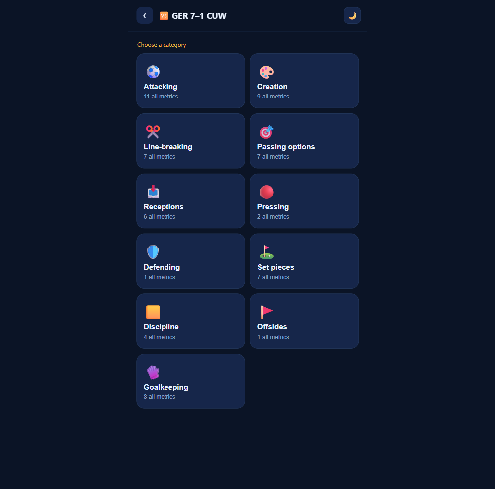

# Reporte: fifaphy como fuente de datos para el prode del Mundial 2026

**Web analizada:** <https://fifaphy.vercel.app/> ("FifaPhy · Físico Mundial 26")
**Método:** Playwright (recorrido + panel Network) + sondeo de la API desde el contexto de la página.
**Fecha del análisis:** 2026-06-15.

---

## 1. Resumen ejecutivo

- fifaphy es un visualizador de **datos físicos y de juego** del Mundial 2026. **No tiene API propia**: lee la **API pública oficial de FIFA** (sin API key).
- La métrica de **alto valor para el modelo es el xG (Expected Goals)** por partido. Está disponible **solo en partidos CERRADOS** (el partido en vivo expone ~36 métricas básicas SIN xG; el xG se publica al terminar).
- **Integré el xG real**: `scrape_fifaphy.py` lo baja y lo pega como `home_xg/away_xg` sobre los fixtures jugados del seed; `ratings_wc` ya lo consume (`XG_WEIGHT=0.6`) para medir la forma de la fecha siguiente. Validación en `analyze_fifaphy.py`.
- El resto de las 145 métricas quedan **catalogadas pero fuera del modelo** (redundantes con el xG o de baja señal para predecir goles pre-partido). Las stats **en vivo no se usan** para predecir ese mismo partido.

---

## 2. Qué muestra la web (rutas)

SPA (Next.js en Vercel). Desde el home se entra a:

| Vista | Contenido |
|---|---|
| 🏃 **Physical Data** | distancia, velocidad, sprints, top speed (por jugador/equipo) |
| 🎮 **Game Data** | **Attacking** (incluye **xG**), Creation, Line-breaking, Passing, Receptions, Pressing, Defending, Set pieces, Discipline, Goalkeeping |
| 📋 Player Report | perfil completo de un jugador, todas las métricas |
| 📊 Standings · 🥇 Leaders · ⭐ Ratings (Best XI) | tablas agregadas |
| 📅 Today/LIVE · ⏱️ Effective time · 💧 Drinks breaks · 🟨 Cards · 🧑‍⚖️ Referees | datos de contexto |

Dentro de Game Data → **Matches** → un partido → **Attacking** aparece *Expected goals (xG)* junto a Goals, Assists, Threat, Shot-ending sequences, Headed attempts, etc. (vista por-90 y total).





---

## 3. La API (lo importante: es JSON oficial de FIFA, sin key)

No hace falta scrapear el DOM. Dos endpoints:

**a) Calendario** — todos los partidos del torneo:
```
GET https://api.fifa.com/api/v3/calendar/matches?language=en&count=500&idSeason=285023
```
- `Results[]`: 104 partidos. Por partido: `IdMatch`, `MatchStatus` (**0 = jugado**, 1 = no empezó, 3 = en vivo), `IdGroup`/`GroupName`, `Date` (UTC), `Home`/`Away` (`IdTeam`, `Abbreviation` FIFA-3, `TeamName`), `HomeTeamScore`/`AwayTeamScore`.
- **Clave del mapeo:** `Properties.IdIFES` es el id de estadísticas (distinto del `IdMatch`).

**b) Estadísticas por equipo** (FIFA Data Hub):
```
GET https://fdh-api.fifa.com/v1/stats/match/{IdIFES}/teams.json
```
- Estructura: `{ idEquipo: [["XG", 4.165, false], ["AttemptAtGoal", 26, false], ...] }` — tuplas `[métrica, valor, esPorcentaje]`.
- **Partido cerrado → 145 métricas (incluye `XG`). Partido en vivo → ~36 métricas básicas, sin `XG`.**
- El `idEquipo` cruza con `Home.IdTeam`/`Away.IdTeam` del calendario para orientar local/visita.

> `requests` plano (sin navegador) llega a ambos endpoints con 200 desde una red sin filtro. Por eso `scrape_fifaphy.py` usa Playwright como camino primario (replica el origen del sitio y esquiva bloqueos por User-Agent) **con fallback automático a `requests`**.

### xG real bajado (los 13 partidos jugados al 15/06)

| Grupo | Partido | Resultado | xG local | xG visita |
|---|---|---:|---:|---:|
| A | México – Sudáfrica | 2–0 | 1.78 | 0.10 |
| A | Corea del Sur – Chequia | 2–1 | 1.77 | 0.64 |
| B | Canadá – Bosnia | 1–1 | 1.50 | 0.76 |
| D | EE.UU. – Paraguay | 4–1 | 1.88 | 0.60 |
| B | Qatar – Suiza | 1–1 | 0.52 | **3.14** |
| C | Brasil – Marruecos | 1–1 | 0.73 | 1.00 |
| C | Haití – Escocia | 0–1 | 0.70 | 0.91 |
| D | Australia – Türkiye | 2–0 | 0.99 | **1.66** |
| E | Alemania – Curazao | 7–1 | 4.17 | 0.40 |
| F | Países Bajos – Japón | 2–2 | 0.63 | 0.34 |
| E | Costa de Marfil – Ecuador | 1–0 | 1.88 | 1.36 |
| F | Suecia – Túnez | 5–1 | 2.09 | 0.34 |
| H | España – Cabo Verde | 0–0 | **2.21** | 0.21 |

En **negrita**, los casos donde el resultado engaña y el xG corrige (Suiza dominó y empató; Türkiye perdió creando más; España dominó un 0-0).

---

## 4. Catálogo de métricas → ¿sirve para un modelo PRE-partido?

Criterio: el prode cierra ~1 min antes del inicio, así que solo sirve lo que se puede medir **antes** del partido. El insumo válido de fifaphy es lo de **partidos ya cerrados**, usado para recalibrar la fuerza de la fecha **siguiente**.

| Métrica (grupo) | Utilidad pre-partido | Por qué |
|---|---|---|
| **XG (Expected Goals)** | 🟢 **ALTA** | Mejor estimador del rendimiento real que el gol crudo; mucho menos ruidoso por partido. **Alimenta la forma para la fecha siguiente.** Es la mejora grande. **(Integrada.)** |
| Threat (xThreat), Shot-ending sequences | 🟡 MEDIA | Señalan dominio territorial/peligro, pero **muy correlacionados con el xG** → aporte marginal. No se integran para no meter redundancia. |
| AttemptAtGoal / OnTarget / dentro del área | 🟡 MEDIA | Volumen y calidad de tiro; **el xG ya los resume** (los pondera por probabilidad de gol). Se guardan al lado solo como transparencia. |
| Possession, PitchControl, FinalThird, Linebreaks, Receptions | 🟠 MEDIA-BAJA | Describen **estilo**, no goles. Débil señal incremental sobre el xG. |
| Pressing (DefensivePressures, ForcedTurnovers, HighPress) | 🟠 MEDIA-BAJA | Estilo defensivo; poca señal directa de goles más allá del xG concedido. |
| Físicas (TotalDistance, TopSpeed, Sprints, HighSpeedRunning) | 🔴 BAJA | Carga física/fitness. No predice goles. Podría servir para **fatiga** en calendario congestionado — fuera del scope actual. |
| Goalkeeping (GKSaves, SavePercentage) | 🔴 BAJA | Depende del rival y del propio resultado (endógeno). |
| Set pieces, Crosses, Cards/Discipline, Offsides | 🔴 BAJA | Situacional; un rojo puntual puede importar pero no es señal estable pre-partido. |
| **Cualquier stat EN VIVO del propio partido** | ⛔ **NULA para ese partido** | El prode ya cerró. Sirve **recién como insumo POST** para recalibrar la fecha siguiente (y el xG en vivo ni siquiera está hasta el cierre). |

**Conclusión:** de 145 métricas, la que mueve la aguja es el **xG**. El resto es redundante con él o de baja señal para un modelo de goles pre-partido. Integrar todo sería ruido; integrar el xG es la mejora honesta.

---

## 5. Qué integré

```
scrape_fifaphy.py    Baja el xG real (Playwright→requests) y lo pega como home_xg/away_xg
                     sobre los fixtures jugados del seed (+cache), con su procedencia.
analyze_fifaphy.py   Valida el efecto: forma con goles vs xG real (mismos partidos).
data_mundial/fifaphy_xg.json   Scrape crudo (13 partidos) + meta de procedencia.
```

- **Cruce de nombres:** reusa `fetch_wc.FIFA3_TO_ISO` + `ALIASES` + `_norm` (mismo cruce que el resto del pipeline).
- **Pegado robusto:** matchea cada partido por **par no-ordenado de equipos** y **orienta** xG y goles al local/visita del fixture (no se rompe si una fuente invierte la localía). Como FIFA publica xG solo de partidos cerrados, al pegar xG también marca el fixture `played` con el score real → el seed queda completo y consistente **offline y online**.
- **Procedencia:** `data_mundial/seed/fixtures.json → meta.xg_provenance` (fuente, motor, timestamp, métrica, n).
- **No pisa nada en vivo:** el `_merge_results` de `fetch_wc` solo toca `status/score`; el `home_xg/away_xg` del seed **sobrevive** al fetch en vivo (verificado: 13/13 con xG tras `load_all()`).

El punto de integración con el motor ya existía: `predict_wc.played_history` lee `home_xg/away_xg` → `hxg/axg`, y `ratings_wc.fit_form`/`update_ratings` los usan (mezcla con goles, peso `XG_WEIGHT`; si falta xG, cae a goles sin romperse).

---

## 6. Validación (efecto del xG real)

`python analyze_fifaphy.py` — forma in-tournament con **goles crudos vs xG real** sobre los mismos 13 partidos (calibrado igual que `update_wc`: `mu0≈2.89`):

- **Países Bajos / Japón** (2-2, xG 0.63-0.34): con goles el ataque se infla (atk **1.22→0.79** NL, **1.43→0.81** JP) — con xG deja de premiar un 2-2 de chiripa.
- **Türkiye** (perdió 0-2 pero más xG, 1.66 vs 0.99): con xG su ataque sube (**0.60→0.73**) y su defensa deja de hundirse (**1.34→0.99**).
- **Suiza** (1-1 dominando, xG 3.14 vs 0.52): con goles parece parejo; con xG su ataque sube (**0.60→0.90**).
- **Elo:** el xG **re-escala la magnitud** del cambio de rating (no su signo): *modera* goleadas con poco xG (EE.UU. 4-1, xG 1.88: +29→+25) y *agranda* la pérdida de un favorito que dominó sin ganar (Suiza 1-1, xG 3.14: cae más, no menos).

**Honestidad:** en la **Fecha 1** el peso de la forma sobre la predicción es bajo (`w_form ≈ 0` con pocos PJ por equipo); el aporte **crece en Fecha 2/3**. Lo estructural ya está: el modelo deja de premiar/castigar finiquitos de chiripa. El número serio sigue siendo la probabilidad y el valor esperado de puntos, no el marcador puntual.

---

## 7. Cómo correrlo

```bash
pip install -r requirements.txt          # incluye playwright
playwright install chromium              # navegador para el scraper
python scrape_fifaphy.py                 # baja xG real y lo pega al seed
python analyze_fifaphy.py                # valida el efecto (goles vs xG)
python update_wc.py --fecha 1            # regenera el HTML usando el xG real
```
